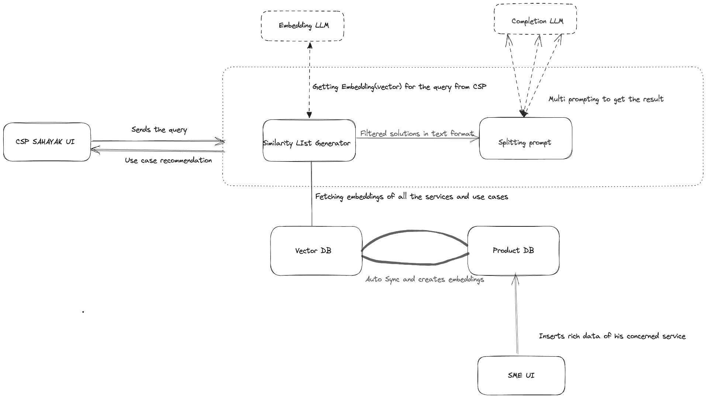
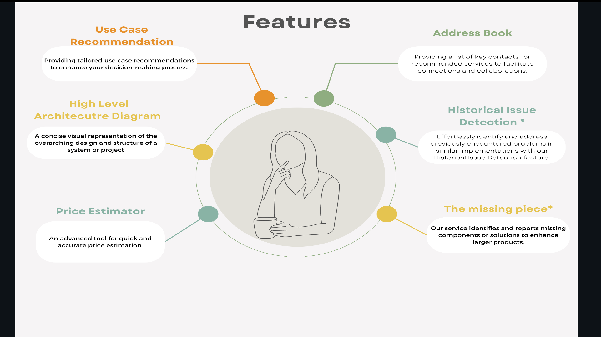

# CSPSahayk
Customer Success Partner Sahayak is a comprehensive solution designed to empower consultants by providing them with a holistic view of potential solutions. It enables consultants to envision the broader scope of a solution, allowing them to direct their attention towards the customer and the specific use case at hand.

Consultant Sahayak can harness the capabilities of Generative AI to gain a comprehensive understanding of SAP's extensive range of products and services, as well as the diverse array of use cases that SAP has successfully addressed.
Architecture (HLD)

Features

The code is still in prtototype face. 
